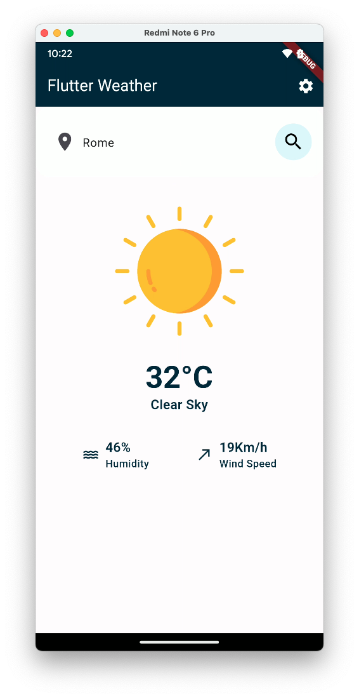

# Flutter Weather 🌦

Minimalistic weather app made with Flutter

This app should let users

* Search the weather forecast for a city
* Enjoy a delightful presentation of the weather information from [OpenWeather API](https://openweathermap.org/current)
* Change the units displayed (metric vs imperial)

## Screenshots

 

  

## Architecture & Libraries

* [Bloc Architecture](https://bloclibrary.dev/#/architecture)
* [Bloc Library](https://bloclibrary.dev/)
* [Equatable](https://pub.dev/packages/equatable)
* [json_serializable](https://pub.dev/packages/json_serializable)
* [Mocktail](https://pub.dev/packages/mocktail)

## Design

* Layout based on the [Weather App](https://github.com/AsmrProg-YT/100-days-of-javascript/tree/master/Day%20%2310%20-%20Weather%20App) by [Reza Mehdikhanlou](https://github.com/AsmrProg-YT)
* [Weather icons](https://www.flaticon.com/packs/weather-219) created by Good Ware - Flaticon